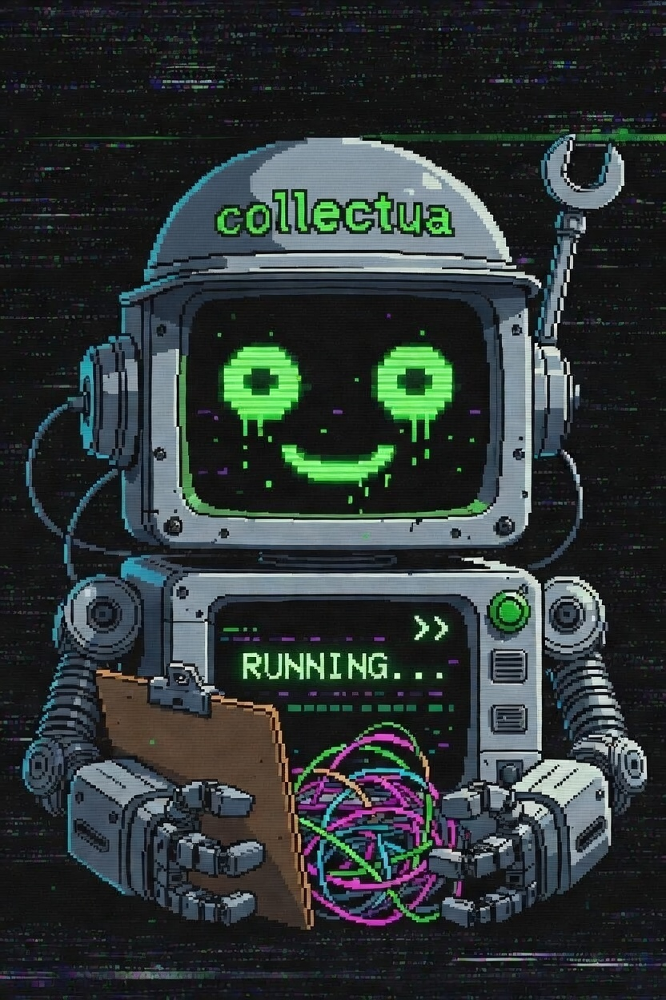
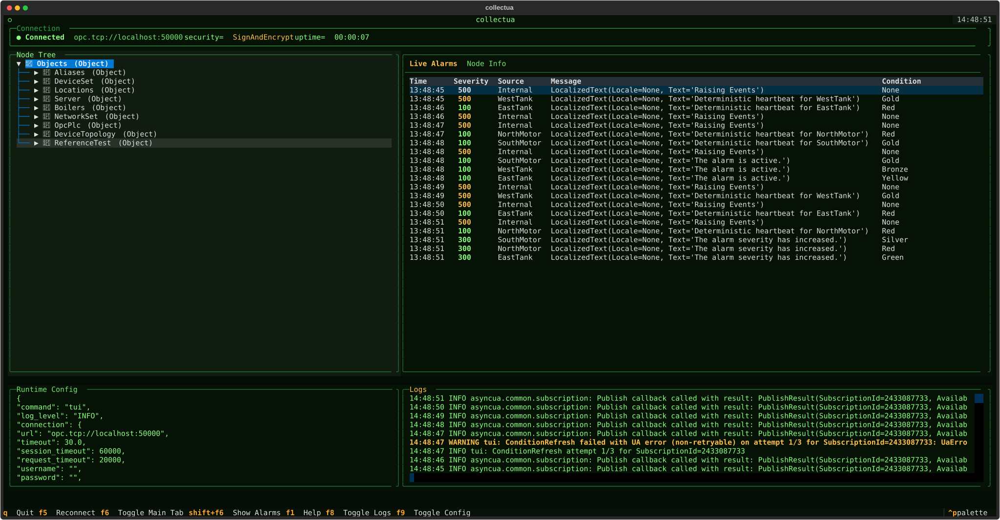

# collectua — Terminal Dashboard and Command-Line Utilities 

## What Is This?

Do you want to monitor and collect alarms/events from your fancy, miserable OPC UA-enabled PLCs right from your command line? Maybe browse that never-ending node tree just to prove a point in a meeting? **This project is for you.**
No GUI required, some technical self-loathing preferred.



- **Textual TUI ("htop" for OPC UA):** Fancy terminal dashboard that streams alarms and lets you poke around the server’s address space.
- **CLI Tools:** Scriptable commands for events, browsing, testing authentication, and backing up your sanity.
- **Alarm/Event Collection:** Just like a NOC but with CSVs. And without a NOC.
- **Auto-profiles:** Sniffs server security capabilities and helps you build connection profiles, meaning less forgetting and less yelling.

## Quickstart

First, check if uv is accesible.
Then do yourself a favor:

```shell
uv tool install --from https://github.com/mberetvas/collectua.git
```

### Run the Terminal Dashboard

   ```
   collectua --tui
   ```

   It will nag you for server addresses and options, and may even generate a password-protected YAML before it dumps you in the terminal dashboard.

### Command-Line Suffering

Jack into a server (replace params as you like):

```shell
collectua browse --url opc.tcp://server:port
collectua collect --url opc.tcp://server:port --csv-file alarms.csv
collectua connect --url opc.tcp://server:port
collectua list-profiles
```

Want to automate certificates? Already handled — it will create them as needed. Rejoice.

## Features

- **TUI Dashboard:**
  - Live alarm/event monitor (AlarmTableWidget)
  - OPC UA node explorer/tree (NodeTreeWidget)
  - Node value/details panel (NodeInfoPanelWidget)
  - Log stream, so you can feel productive
  - 1995-style tabbed panels & help screen
- **CLI:**
  - `browse`: Crawl OPC UA node tree, print indented spam
  - `collect`: Log and append events to CSV forever (or until Ctrl+C/management stops you)
  - `connect`: Does the server even let you in?
  - `config`: Show or validate every detail before it yells at you.
  - Profiles YAML lookup (auto-suggest if your memory fails)
- **Security:**
  - Supports insecure ("None_") and real encrypted modes (because factory default isn’t safe, but... you know)
  - Prompts to trust unverified server certificates
  - Auto-generates self-signed client certs if required

## Configuration

- Connection profiles are YAML blobs squirrelled in `./connections` or `~/.config/opcua-client/connections`
- To auto-create profiles, provide a URL without one. You'll get prompted more than at airport security.
- Security modes: "None_", "Sign", "SignAndEncrypt" (actual security feeling not included)
- Logging & debug files via `--mode debug`
- Browse depth defaults to 3 — raise it if you hate yourself

## Running Tests

If you want to pretend this has good test coverage:

```shell
pytest
```

## Spoilers and Annoyances

- Requires Python 3.12+ and actual basic computer skills.
- CSV log will overwrite eventually, and yes, you’ll open it with Excel once. Don’t say I didn’t warn you.
- Comes with Docker "justfile" helpers for spinning up test servers. You won’t read that either, but you should.
- For Siemens S7-1500 nerds, supports the (broken) UA Condition event structure.
- UI only offers read-only browsing/monitoring, because too much power is dangerous.

## Project Structure

- `src/opcua_client/`: All actual source code, organized by function.
  - `tui/widgets/`: Each TUI panel or widget here, as proper python modules.
  - `cli.py`: All commands live here. Yes, it's a big script; hire an intern for refactoring.
  - `profile_loader.py`, `profile_autosetup.py`: Handle connection profiles so you don't have to think.
- `tests/`: Obvious.
- `justfile`: Repo dev Docker/do-things helper (requires [just](https://github.com/casey/just)).
- `.github/skills/`: Apparently some wizardry for GitHub Copilot/integration, or legacy dreams.

## License

MIT. So if it starts a factory fire, don’t come blaming me.

## Support/Contributing

Open a PR, file an issue, or shout into the void. Full Code of Conduct and Contribution guides provided (but ignored at your own risk).

---

**Congratulations, you are now equipped for industrial-grade masochism.**
For more info, try the help commands or just start the TUI and hammer every F-key until something breaks.